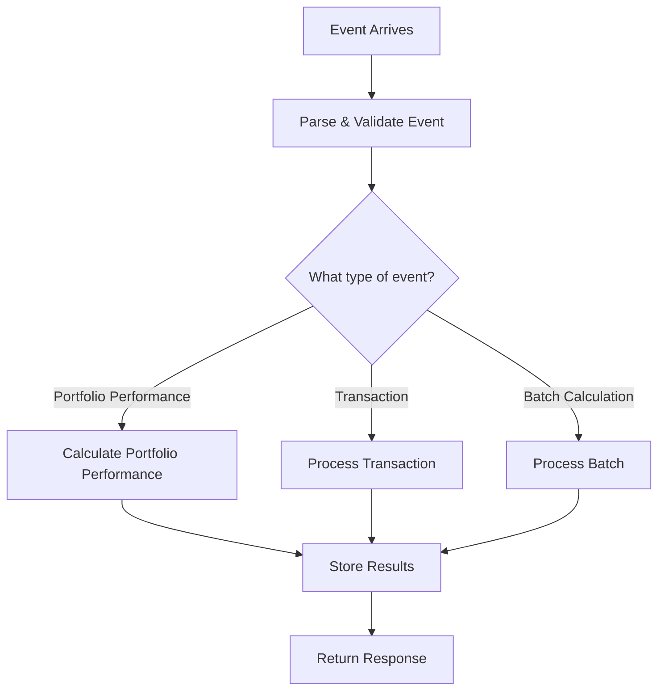

# Performance Calculator - Technical Design

## 📋 System Architecture Overview

The Performance Calculator is a serverless application built with Rust that calculates investment performance metrics. It is designed to be highly scalable, efficient, and accurate, leveraging AWS Lambda for serverless execution.

### 🏗️ High-Level Architecture

```
┌─────────────────┐     ┌─────────────────┐     ┌─────────────────┐
│                 │     │                 │     │                 │
│  Event Sources  │────▶│  AWS Lambda     │────▶│  Data Storage   │
│  (API, S3, etc) │     │  Function       │     │  (DynamoDB,     │
│                 │     │                 │     │   Timestream)   │
└─────────────────┘     └─────────────────┘     └─────────────────┘
                               │
                               │
                               ▼
                        ┌─────────────────┐
                        │                 │
                        │  Calculation    │
                        │  Modules        │
                        │                 │
                        └─────────────────┘
```

**What's happening here?**
1. An event (like a request to calculate portfolio performance) comes from an API Gateway, S3 bucket, or other source
2. Our AWS Lambda function receives this event
3. The function processes the event using our calculation modules
4. Results are stored in databases (DynamoDB for structured data, Timestream for time-series data)

### 🧩 Component Breakdown

Think of our system as a set of building blocks that work together:

#### 1. **Event Handler (`main.rs`)**: 
   - **What it does**: This is the "front door" of our application
   - **How it works**: 
     - Receives events (like "calculate this portfolio's performance")
     - Figures out what type of calculation to perform
     - Calls the right functions to do the work
     - Returns the results

#### 2. **Calculation Modules (`calculations/`)**: 
   - **What they do**: These are the "brains" of our application
   - **How they work**:
     - Each module specializes in a specific type of calculation
     - For example, `risk_metrics.rs` handles volatility and Sharpe ratio calculations
     - They take input data and return calculation results

#### 3. **Caching System (`calculations/cache.rs`)**: 
   - **What it does**: Makes our application faster by remembering previous calculations
   - **How it works**:
     - Stores calculation results in memory
     - Checks if we've done a calculation before
     - Returns cached results when possible to avoid recalculating

#### 4. **Parallel Processing (`calculations/parallel.rs`)**: 
   - **What it does**: Helps us calculate many things at once
   - **How it works**:
     - Splits batch operations into smaller tasks
     - Runs multiple calculations simultaneously
     - Controls how many calculations run at once to prevent overload

#### 5. **Error Handling (`calculations/error_handling.rs`)**: 
   - **What it does**: Makes our application more reliable
   - **How it works**:
     - Tries operations again if they fail temporarily
     - Waits longer between retries if problems persist
     - Provides helpful error messages

#### 6. **Configuration (`config.rs`)**: 
   - **What it does**: Makes our application flexible and customizable
   - **How it works**:
     - Reads settings from environment variables or files
     - Provides default values when settings aren't specified
     - Makes configuration available throughout the application

## 🔄 Data Flow

### Event Processing Flow



**Step-by-step explanation:**
1. **Event Arrives**: A JSON event is sent to our Lambda function
2. **Parse & Validate**: We check if the event has all the required fields
3. **Route by Type**: We determine what kind of calculation to perform
4. **Perform Calculation**: We execute the appropriate calculation logic
5. **Store Results**: We save the results to our databases
6. **Return Response**: We send back a success or error message

### Calculation Flow

```
┌─────────────────┐     ┌─────────────────┐     ┌─────────────────┐
│                 │     │                 │     │                 │
│  Input Data     │────▶│  Cache Lookup   │────▶│  Calculation    │
│  (Transactions, │     │  (If enabled)   │     │  Execution      │
│   Holdings)     │     │                 │     │                 │
└─────────────────┘     └─────────────────┘     └─────────────────┘
                                                        │
                                                        │
                                                        ▼
┌─────────────────┐     ┌─────────────────┐     ┌─────────────────┐
│                 │     │                 │     │                 │
│  Response       │◀────│  Cache Update   │◀────│  Result         │
│  Generation     │     │  (If enabled)   │     │  Processing     │
│                 │     │                 │     │                 │
└─────────────────┘     └─────────────────┘     └─────────────────┘
```

**What's happening here?**
1. We gather the input data (like transactions and holdings)
2. We check if we've done this calculation before (cache lookup)
3. If not in cache, we perform the calculation
4. We process the results (like formatting or aggregating)
5. We update our cache with the new results
6. We generate and return a response

## 💻 Implementation Details

### Performance Metrics Calculation

#### Time-Weighted Return (TWR)

TWR measures how investments perform regardless of when money was added or withdrawn. We implement two methods:

##### 1. **Modified Dietz Method**:

```rust
pub fn calculate_modified_dietz(
    beginning_value: Decimal,
    ending_value: Decimal,
    cash_flows: &[CashFlow],
    start_date: NaiveDate,
    end_date: NaiveDate
) -> Result<TimeWeightedReturn>
```

**How it works (in plain English):**
- We take the starting and ending values of a portfolio
- We look at all the money added or withdrawn during the period
- We weight each cash flow based on when it happened in the period
- We calculate the return using this formula:

```
TWR = (Ending Value - Beginning Value - Net Cash Flow) / (Beginning Value + Weighted Cash Flow)
```

**Visual explanation:**

```
Beginning Value: $10,000
Ending Value: $11,000
Cash Flow: $1,000 deposit halfway through the period

Weighted Cash Flow = $1,000 * 0.5 = $500 (weighted at 50% because it was halfway through)
TWR = ($11,000 - $10,000 - $1,000) / ($10,000 + $500) = 0 / $10,500 = 0%

This makes sense because the ending value ($11,000) equals the beginning value ($10,000) 
plus the cash flow ($1,000), meaning there was no actual investment return.
```

##### 2. **Daily Valuation Method**:

```rust
pub fn calculate_daily_twr(
    daily_values: &[(NaiveDate, Decimal)],
    cash_flows: &[CashFlow]
) -> Result<TimeWeightedReturn>
```

**How it works (in plain English):**
- We look at the portfolio value for each day
- We calculate the return for each day or period between cash flows
- We link these returns together using geometric linking (multiplying them together)

```
Sub-period Return = Ending Value / (Beginning Value + Cash Flow) - 1
TWR = [(1 + R₁) * (1 + R₂) * ... * (1 + Rₙ)] - 1
```

**Visual explanation:**

```
Day 1: $10,000
Day 2: $10,200 (2% daily return)
Day 2: $1,000 deposit (after market close)
Day 3: $11,330 (1% daily return on $11,200)

Period 1 Return: ($10,200 / $10,000) - 1 = 2%
Period 2 Return: ($11,330 / ($10,200 + $1,000)) - 1 = 1%

TWR = [(1 + 0.02) * (1 + 0.01)] - 1 = 1.0302 - 1 = 3.02%
```

#### Money-Weighted Return (MWR)

MWR (also called IRR) measures the performance considering the size and timing of cash flows:

```rust
pub fn calculate_irr(
    cash_flows: &[CashFlow],
    final_value: Decimal,
    max_iterations: usize,
    tolerance: Decimal
) -> Result<MoneyWeightedReturn>
```

**How it works (in plain English):**
- We list all cash flows (money in/out) with their dates
- We add the final portfolio value as the last cash flow
- We find the discount rate that makes the present value of all cash flows equal to zero
- This discount rate is the IRR or MWR

```
0 = CF₀ + CF₁/(1+IRR)¹ + CF₂/(1+IRR)² + ... + CFₙ/(1+IRR)ⁿ
```

**Visual explanation:**

```
Initial investment (CF₀): -$10,000 on Jan 1 (negative because money leaves your pocket)
Cash flow (CF₁): -$2,000 on Apr 1 (another investment)
Final value (CF₂): +$13,200 on Dec 31 (positive because you receive this money)

We find the IRR that solves:
0 = -$10,000 + -$2,000/(1+IRR)^(91/365) + $13,200/(1+IRR)^1

The solution is IRR = 10%, which is the money-weighted return.
```

### Risk Metrics Calculation

We calculate various risk metrics to understand the risk-adjusted performance:

```rust
pub fn calculate_risk_metrics(
    returns: &[Decimal],
    annualized_return: Decimal,
    benchmark_returns: Option<&[Decimal]>,
    annualized_benchmark_return: Option<Decimal>,
    risk_free_rate: Option<Decimal>
) -> RiskMetrics
```

#### Key Risk Metrics Explained:

##### 1. **Volatility**

**What it is:** A measure of how much returns fluctuate over time.

**Formula:** Standard deviation of returns
```
Volatility = √(Σ(Rᵢ - R̄)² / n)
```

**Example:**
```
Returns: 2%, -1%, 3%, -2%, 4%
Average Return: 1.2%
Variance: [(2% - 1.2%)² + (-1% - 1.2%)² + (3% - 1.2%)² + (-2% - 1.2%)² + (4% - 1.2%)²] / 5
        = [0.8%² + (-2.2%)² + 1.8%² + (-3.2%)² + 2.8%²] / 5
        = [0.0064% + 0.0484% + 0.0324% + 0.1024% + 0.0784%] / 5
        = 0.0536%
Volatility = √0.0536% = 2.32%
```

##### 2. **Sharpe Ratio**

**What it is:** Measures excess return per unit of risk.

**Formula:**
```
Sharpe Ratio = (R - Rᶠ) / σ
```
Where:
- R = Portfolio return
- Rᶠ = Risk-free rate
- σ = Portfolio volatility

**Example:**
```
Portfolio Return: 10%
Risk-free Rate: 2%
Volatility: 15%

Sharpe Ratio = (10% - 2%) / 15% = 8% / 15% = 0.53
```

##### 3. **Maximum Drawdown**

**What it is:** The largest peak-to-trough decline in portfolio value.

**How it works:**
- Track the cumulative value of the portfolio over time
- Find the largest percentage drop from a peak to a subsequent trough

**Example:**
```
Portfolio values: $100, $105, $103, $110, $95, $100, $105
Drawdowns: 0%, 0%, 1.9%, 0%, 13.6%, 9.1%, 0%
Maximum Drawdown: 13.6%
```

### Caching Implementation

Our caching system makes calculations faster by storing previous results:

```rust
pub struct CalculationCache<K, V> 
where 
    K: Eq + Hash + Clone,
    V: Clone,
{
    cache: Arc<Mutex<HashMap<K, CacheEntry<V>>>>,
    ttl_seconds: i64,
}
```

**How it works (in plain English):**
- We store calculation results in a hash map (like a dictionary)
- Each entry has a timestamp for when it should expire
- When we need a calculation, we first check if it's in the cache
- If it's in the cache and not expired, we use that result
- If not, we perform the calculation and store the result in the cache

**Example usage:**

```rust
// Create a cache with 1-hour expiration
let cache = CalculationCache::new(3600);

// Get or compute a value
let result = cache.get_or_compute("portfolio-123", || {
    // This function only runs if the value isn't in the cache
    calculate_portfolio_performance("portfolio-123")
}).await?;
```

### Parallel Processing Implementation

Our parallel processing system helps us handle multiple calculations at once:

```rust
pub async fn process_batch<T, F, Fut, R>(
    items: Vec<T>,
    max_concurrency: usize,
    process_fn: F,
    request_id: &str,
) -> Result<Vec<R>>
where
    T: Send + Sync + 'static,
    R: Send + 'static,
    F: Fn(T) -> Fut + Send + Sync + Clone + 'static,
    Fut: std::future::Future<Output = Result<R>> + Send,
```

**How it works (in plain English):**
- We take a list of items to process (like portfolio IDs)
- We set a maximum number of items to process at once
- We create a task for each item
- We run these tasks in parallel, but no more than the maximum at once
- We collect all the results into a single list

**Example usage:**

```rust
// Process up to 5 portfolios at once
let results = process_batch(
    portfolio_ids,
    5,
    |portfolio_id| async move {
        calculate_portfolio_performance(portfolio_id).await
    },
    &request_id
).await?;
```

## 💾 Data Storage Schemas

### DynamoDB Schema

We use DynamoDB to store calculation results and metadata:

#### Performance Metrics Table

| Attribute | Type | Description |
|-----------|------|-------------|
| `id` | String | Primary key, format: `{entity_type}#{entity_id}` |
| `calculation_date` | String | Sort key, ISO format date |
| `entity_type` | String | "portfolio", "account", or "security" |
| `entity_id` | String | ID of the entity |
| `time_period` | String | Time period for the calculation |
| `twr` | Number | Time-weighted return |
| `mwr` | Number | Money-weighted return |
| `volatility` | Number | Volatility (standard deviation of returns) |
| `sharpe_ratio` | Number | Sharpe ratio |
| `max_drawdown` | Number | Maximum drawdown |
| `calculation_method` | String | Method used for calculation |
| `request_id` | String | ID of the request that triggered the calculation |
| `created_at` | String | ISO format timestamp |
| `updated_at` | String | ISO format timestamp |

**Example item:**

```json
{
  "id": "portfolio#port-12345",
  "calculation_date": "2023-06-30",
  "entity_type": "portfolio",
  "entity_id": "port-12345",
  "time_period": "1Y",
  "twr": 0.0842,
  "mwr": 0.0789,
  "volatility": 0.1245,
  "sharpe_ratio": 0.5123,
  "max_drawdown": 0.1532,
  "calculation_method": "daily",
  "request_id": "req-98765",
  "created_at": "2023-07-01T10:15:30Z",
  "updated_at": "2023-07-01T10:15:30Z"
}
```

### Timestream Schema

We use Timestream to store time-series data for performance metrics:

#### Performance Metrics Table

**Dimensions:**

| Dimension | Description |
|-----------|-------------|
| `entity_type` | "portfolio", "account", or "security" |
| `entity_id` | ID of the entity |
| `calculation_method` | Method used for calculation |
| `request_id` | ID of the request that triggered the calculation |

**Measures:**

| Measure | Type | Description |
|---------|------|-------------|
| `twr` | DOUBLE | Time-weighted return |
| `mwr` | DOUBLE | Money-weighted return |
| `volatility` | DOUBLE | Volatility |
| `sharpe_ratio` | DOUBLE | Sharpe ratio |
| `max_drawdown` | DOUBLE | Maximum drawdown |

**Example query:**

```sql
SELECT time, measure_value::double AS twr
FROM "investment_performance"."performance_metrics"
WHERE entity_type = 'portfolio'
  AND entity_id = 'port-12345'
  AND measure_name = 'twr'
  AND time BETWEEN '2023-01-01' AND '2023-06-30'
ORDER BY time ASC
```

## ⚡ Performance Considerations

### Optimization Techniques

1. **Caching Strategy**
   - Cache frequently accessed calculations
   - Use time-based expiration to balance freshness and performance
   - Implement cache warming for common queries

2. **Batch Processing**
   - Process multiple calculations in parallel
   - Control concurrency to prevent resource exhaustion
   - Use efficient data structures to minimize memory usage

3. **Database Access Patterns**
   - Use query patterns that align with DynamoDB's partition and sort keys
   - Implement pagination for large result sets
   - Use sparse indexes for efficient filtering

4. **Lambda Configuration**
   - Optimize memory allocation based on workload
   - Configure timeout values appropriately
   - Use provisioned concurrency for predictable performance

## 🔒 Security Considerations

1. **Data Protection**
   - Encrypt sensitive data at rest and in transit
   - Implement least privilege access for AWS resources
   - Use IAM roles with specific permissions

2. **Input Validation**
   - Validate all input parameters
   - Implement size limits for inputs
   - Sanitize inputs to prevent injection attacks

3. **Logging and Monitoring**
   - Log all operations with appropriate detail
   - Implement CloudWatch alarms for error rates
   - Set up monitoring for unusual activity

## 🧪 Testing Strategy

1. **Unit Testing**
   - Test individual calculation functions
   - Use property-based testing for mathematical functions
   - Mock external dependencies

2. **Integration Testing**
   - Test the interaction between components
   - Verify database operations
   - Test error handling and retry logic

3. **Performance Testing**
   - Measure calculation time for different portfolio sizes
   - Test parallel processing with varying concurrency
   - Verify cache effectiveness

## 🚀 Deployment and Operations

1. **Deployment Process**
   - Build for Amazon Linux 2 (x86_64-unknown-linux-musl)
   - Package as a ZIP file
   - Deploy using AWS CLI or CloudFormation

2. **Monitoring**
   - Set up CloudWatch dashboards
   - Configure alarms for error rates and duration
   - Implement structured logging

3. **Scaling**
   - Configure Lambda concurrency limits
   - Implement backoff strategies for downstream services
   - Monitor and adjust based on usage patterns

## 📚 Key Dependencies

| Dependency | Version | Purpose |
|------------|---------|---------|
| `rust_decimal` | 1.25 | Precise decimal arithmetic |
| `tokio` | 1.20 | Async runtime |
| `aws-sdk-dynamodb` | 0.17 | DynamoDB client |
| `aws-sdk-timestreamwrite` | 0.17 | Timestream client |
| `serde` | 1.0 | Serialization/deserialization |
| `chrono` | 0.4 | Date and time handling |
| `tracing` | 0.1 | Structured logging |
| `anyhow` | 1.0 | Error handling |

## 🔄 Future Enhancements

1. **Multi-Currency Support**
   - Handle portfolios with multiple currencies
   - Calculate FX impact on performance
   - Support currency conversion for reporting

2. **Advanced Attribution Analysis**
   - Implement multi-factor attribution models
   - Support sector and style attribution
   - Add fixed income attribution

3. **Machine Learning Integration**
   - Implement anomaly detection for performance metrics
   - Develop predictive models for risk assessment
   - Create recommendation systems for portfolio optimization 

AWSTemplateFormatVersion: '2010-09-09'
Transform: AWS::Serverless-2016-10-31
Description: Investment Performance Calculator

Resources:
  # API Gateway
  ApiGateway:
    Type: AWS::Serverless::Api
    Properties:
      StageName: v1
      Auth:
        DefaultAuthorizer: JwtAuthorizer
        Authorizers:
          JwtAuthorizer:
            FunctionArn: !GetAtt ApiHandlerFunction.Arn
      MethodSettings:
        - ResourcePath: '/*'
          HttpMethod: '*'
          MetricsEnabled: true
          DataTraceEnabled: true
          LoggingLevel: INFO

  # Lambda Functions
  ApiHandlerFunction:
    Type: AWS::Serverless::Function
    Properties:
      CodeUri: ./api-handler/
      Handler: bootstrap
      Runtime: provided.al2
      Architectures:
        - arm64
      MemorySize: 256
      Timeout: 30
      Environment:
        Variables:
          DYNAMODB_TABLE: !Ref DynamoDBTable
          SQS_QUEUE_URL: !Ref EventQueue
          JWT_SECRET: !Sub '{{resolve:secretsmanager:investment-performance:SecretString:JwtSecret}}'
      Policies:
        - DynamoDBCrudPolicy:
            TableName: !Ref DynamoDBTable
        - SQSSendMessagePolicy:
            QueueName: !GetAtt EventQueue.QueueName
      Events:
        ApiEvent:
          Type: Api
          Properties:
            RestApiId: !Ref ApiGateway
            Path: /{proxy+}
            Method: ANY

  PerformanceCalculatorFunction:
    Type: AWS::Serverless::Function
    Properties:
      CodeUri: ./performance-calculator/
      Handler: bootstrap
      Runtime: provided.al2
      Architectures:
        - arm64
      MemorySize: 1024
      Timeout: 60
      Environment:
        Variables:
          DYNAMODB_TABLE: !Ref DynamoDBTable
          TIMESTREAM_DATABASE: !Ref TimestreamDatabase
          TIMESTREAM_TABLE: !Ref TimestreamTable
      Policies:
        - DynamoDBReadPolicy:
            TableName: !Ref DynamoDBTable
        - TimestreamReadPolicy:
            DatabaseName: !Ref TimestreamDatabase
            TableName: !Ref TimestreamTable
      Events:
        ApiEvent:
          Type: Api
          Properties:
            RestApiId: !Ref ApiGateway
            Path: /calculate
            Method: POST

  EventProcessorFunction:
    Type: AWS::Serverless::Function
    Properties:
      CodeUri: ./event-processor/
      Handler: bootstrap
      Runtime: provided.al2
      Architectures:
        - arm64
      MemorySize: 256
      Timeout: 30
      Environment:
        Variables:
          DYNAMODB_TABLE: !Ref DynamoDBTable
          TIMESTREAM_DATABASE: !Ref TimestreamDatabase
          TIMESTREAM_TABLE: !Ref TimestreamTable
      Policies:
        - DynamoDBCrudPolicy:
            TableName: !Ref DynamoDBTable
        - TimestreamWritePolicy:
            DatabaseName: !Ref TimestreamDatabase
            TableName: !Ref TimestreamTable
      Events:
        SQSEvent:
          Type: SQS
          Properties:
            Queue: !GetAtt EventQueue.Arn
            BatchSize: 10

  # DynamoDB Table
  DynamoDBTable:
    Type: AWS::DynamoDB::Table
    Properties:
      BillingMode: PAY_PER_REQUEST
      AttributeDefinitions:
        - AttributeName: id
          AttributeType: S
        - AttributeName: entity_type
          AttributeType: S
        - AttributeName: client_id
          AttributeType: S
        - AttributeName: account_id
          AttributeType: S
      KeySchema:
        - AttributeName: id
          KeyType: HASH
        - AttributeName: entity_type
          KeyType: RANGE
      GlobalSecondaryIndexes:
        - IndexName: ClientIndex
          KeySchema:
            - AttributeName: client_id
              KeyType: HASH
            - AttributeName: entity_type
              KeyType: RANGE
          Projection:
            ProjectionType: ALL
        - IndexName: AccountIndex
          KeySchema:
            - AttributeName: account_id
              KeyType: HASH
            - AttributeName: entity_type
              KeyType: RANGE
          Projection:
            ProjectionType: ALL
      PointInTimeRecoverySpecification:
        PointInTimeRecoveryEnabled: true
      SSESpecification:
        SSEEnabled: true

  # Timestream Database and Table
  TimestreamDatabase:
    Type: AWS::Timestream::Database
    Properties:
      DatabaseName: investment-performance

  TimestreamTable:
    Type: AWS::Timestream::Table
    Properties:
      DatabaseName: !Ref TimestreamDatabase
      TableName: performance-metrics
      RetentionProperties:
        MemoryStoreRetentionPeriodInHours: 24
        MagneticStoreRetentionPeriodInDays: 365

  # SQS Queue
  EventQueue:
    Type: AWS::SQS::Queue
    Properties:
      VisibilityTimeout: 300
      MessageRetentionPeriod: 1209600 # 14 days
      RedrivePolicy:
        deadLetterTargetArn: !GetAtt EventDeadLetterQueue.Arn
        maxReceiveCount: 5

  EventDeadLetterQueue:
    Type: AWS::SQS::Queue
    Properties:
      MessageRetentionPeriod: 1209600 # 14 days

  # CloudWatch Alarms
  ApiErrorAlarm:
    Type: AWS::CloudWatch::Alarm
    Properties:
      AlarmDescription: Alarm for API errors
      MetricName: 5XXError
      Namespace: AWS/ApiGateway
      Statistic: Sum
      Period: 60
      EvaluationPeriods: 1
      Threshold: 5
      ComparisonOperator: GreaterThanThreshold
      Dimensions:
        - Name: ApiName
          Value: !Ref ApiGateway
        - Name: Stage
          Value: v1

  # Secrets Manager for JWT Secret
  JwtSecret:
    Type: AWS::SecretsManager::Secret
    Properties:
      Description: JWT secret for Investment Performance API
      GenerateSecretString:
        SecretStringTemplate: '{"JwtSecret":""}'
        GenerateStringKey: "JwtSecret"
        PasswordLength: 32
        ExcludeCharacters: '"@/\'

Outputs:
  ApiEndpoint:
    Description: API Gateway endpoint URL
    Value: !Sub https://${ApiGateway}.execute-api.${AWS::Region}.amazonaws.com/v1/ 